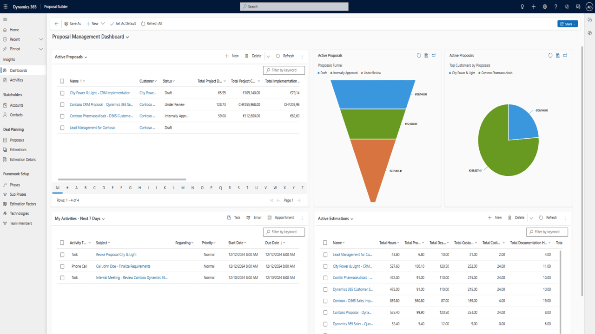
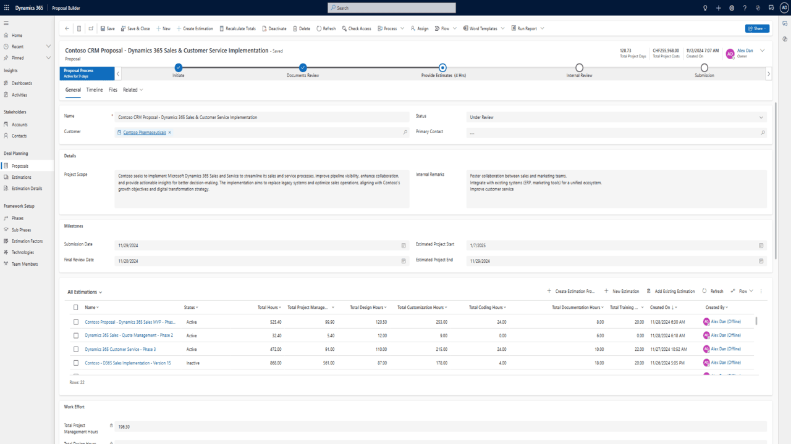
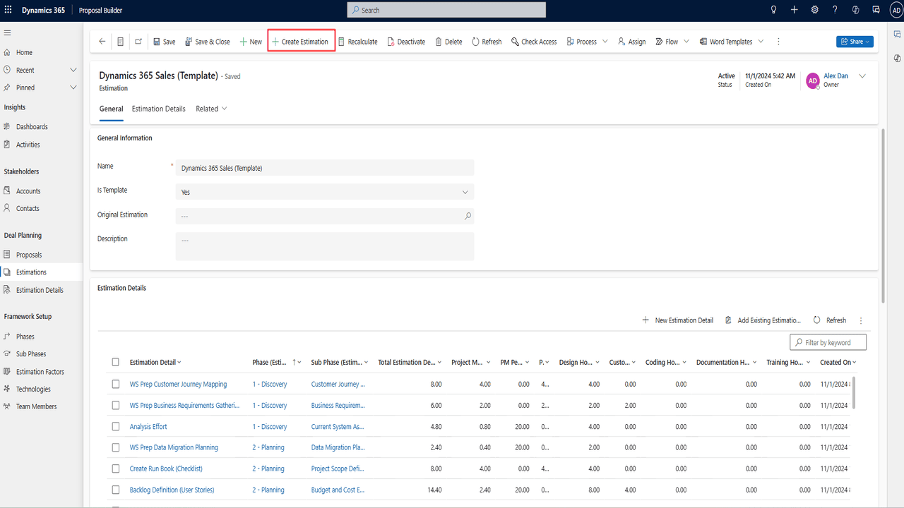
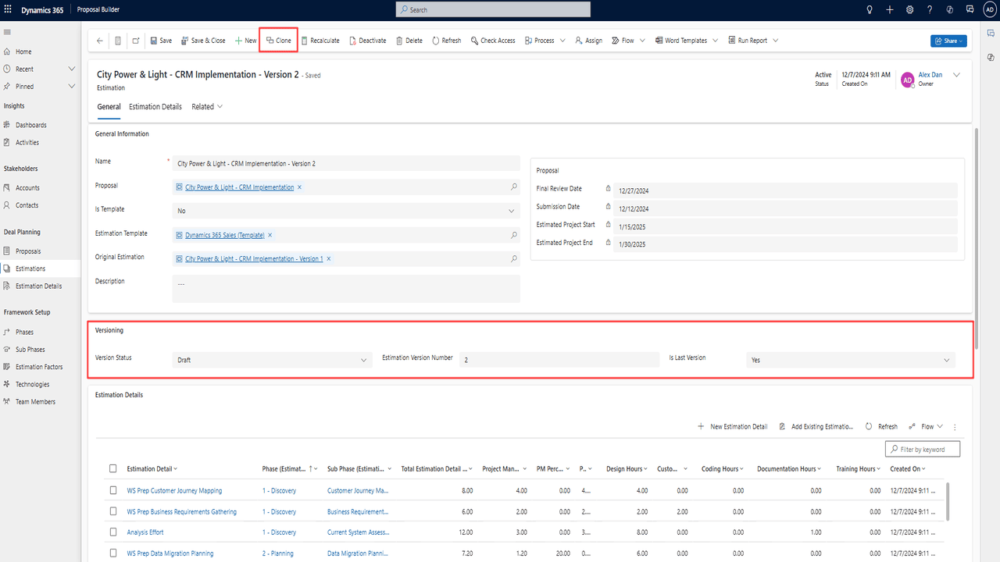

# Proposal Builder App

A **Power Apps model-driven application** designed to streamline the presales process by simplifying proposal management and project estimation. This app helps sales teams, presales consultants, and project managers collaborate efficiently to create, track, and refine proposals.

---

## Key Features:
- **Proposal Management Dashboard**: Centralized view of all active proposals with status tracking and visual funnels.
- **Guided Proposal Creation**: Step-by-step workflows to ensure consistent and professional proposals.
- **Estimation Management**: Pre-built templates for accurate project estimations, customizable to fit specific workflows.
- **Version Control**: Clone and refine estimations to manage evolving requirements with ease.
- **Advanced Reporting**: Dashboards for monitoring progress, milestones, and success metrics.
- **Collaboration**: Seamless integration with Dynamics 365 Sales for a unified presales experience.

---

## Who Can Benefit?
- **Sales Teams**: Quickly generate professional proposals for potential clients.
- **Presales Consultants**: Create precise estimations to support project planning.
- **Business Leaders**: Gain insights into the presales pipeline with analytics and reporting.

---

## Getting Started:
1. **Download** the managed solution file from the repository.
2. **Import** it into your Power Apps environment.
3. **Configure** user roles, workflows, and estimation templates as per your business needs.
4. Start managing your proposals with **efficiency and accuracy**!

---

## Screenshots

### Proposal Manager Dashboard

### Proposal Form

### Estimation Template Form

### Estimation Form Versioning

---

## Video:
Full Video https://www.youtube.com/watch?v=Vq67J4PyJxE&list=PLQblSszTOxyzEw0DfkDgI9j_incp4lSYr&index=2

---

## Support:
For questions, feature requests, or contributions, feel free to open an issue or contact us directly.
